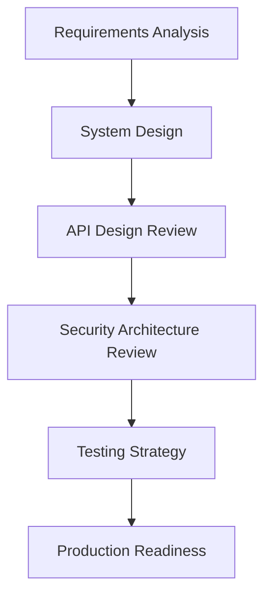
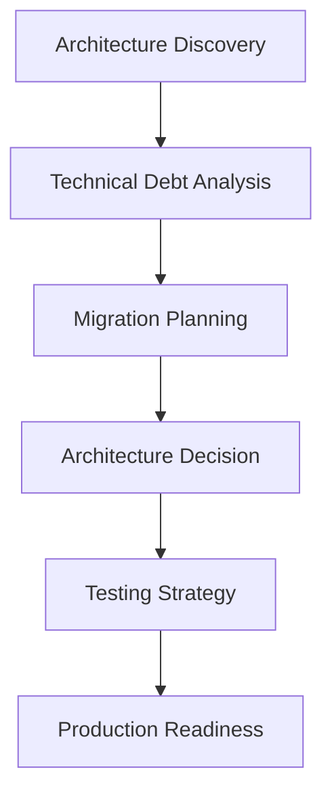
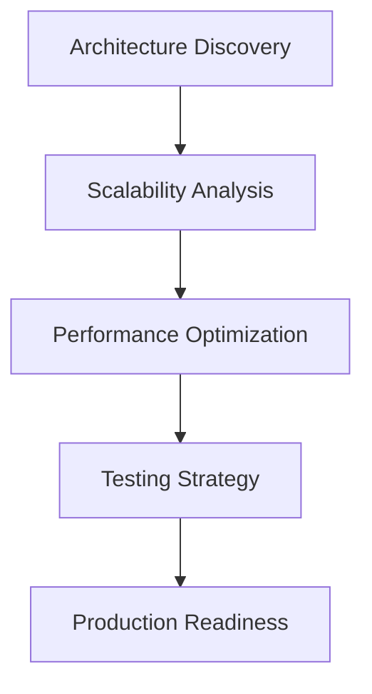
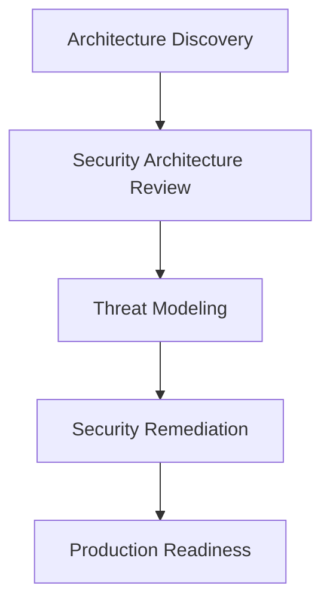

# Examples and Use Cases

## Real-World Scenarios

This guide provides practical examples of using engineering skills in real-world situations.

For complete, reusable sequences, see the [workflow recipes](../workflows/README.md). The scenarios below show how those compositions can be executed through an agent or manually.

For standalone domain examples with explicit constraints, decisions, outputs, and quality gates, see the [examples directory](../examples/README.md).

Frontend-specific scenarios are collected in the [frontend examples index](../examples/frontend/README.md), including accessible checkout, design-system rollout, dashboard performance, and framework migration.

The [E2E examples index](../examples/e2e/README.md) covers checkout, banking transfer, tenant isolation, MFA, file upload, and mobile dashboard journeys.

Each advanced E2E skill also includes focused examples for mobile-native behavior, visual regression, performance journeys, frontend/backend contracts, failure analytics, and test maintenance automation.

## Scenario 1: New Microservice Development

**Problem:** Design and implement a new user authentication microservice

### Approach

```python
# Step 1: Orchestrate
workflow = orchestrator.orchestrate(
    problem="Design new authentication microservice",
    context={
        "requirements": "OAuth2, JWT, MFA support",
        "existing_system": "Monolithic auth in main app",
        "constraints": "Must integrate with existing user database"
    }
)

# Workflow determined:
# 1. requirements-analysis
# 2. system-design
# 3. api-design-review
# 4. security-architecture-review
# 5. data-architecture-review
# 6. testing-strategy
# 7. production-readiness

# Step 2: Execute workflow
for step in workflow:
    result = executor.execute_skill(step['skill'], step['inputs'])
    print(f"Completed: {step['skill']}")
    print(result['output'])
```

### Expected Outputs

- Clear requirements document
- System architecture diagram
- API specification
- Security review findings
- Data model design
- Testing strategy
- Production readiness checklist

## Scenario 2: Legacy System Migration

**Problem:** Migrate legacy monolith to cloud-native microservices

### Cursor Workflow

```
@Composer I need to migrate our legacy system to microservices.

Use skill-orchestrator to determine the workflow, then execute:

Current state:
- Java monolith (500K LOC)
- Oracle database
- On-premise deployment
- 200K daily users

Target state:
- Cloud-native microservices
- AWS infrastructure
- Containerized deployment
- Zero downtime migration

Constraints:
- 6-month timeline
- Limited team (5 engineers)
- Cannot rewrite everything
```

### Cursor Executes

1. `architecture-discovery` - Map current architecture
2. `technical-debt-analysis` - Identify problem areas
3. `service-boundary-analysis` - Define microservice boundaries
4. `data-architecture-review` - Plan data migration
5. `migration-planning` - Create migration roadmap
6. `architecture-decision` - Document key decisions
7. `testing-strategy` - Plan testing approach
8. `production-readiness` - Ensure operational readiness

## Scenario 3: Production Incident Response

**Problem:** Database performance degradation in production

### Claude API Workflow

```python
# Incident response workflow
incident_context = {
    "incident": "Database queries taking 10x longer than normal",
    "symptoms": "API response times increased from 200ms to 2000ms",
    "affected_services": ["user-service", "order-service"],
    "started": "2 hours ago",
    "metrics": "CPU 90%, Memory 75%, Disk I/O 95%"
}

# Execute incident analysis skills
results = []

# 1. Incident analysis
results.append(
    executor.execute_skill('incident-analysis', incident_context)
)

# 2. Root cause analysis
results.append(
    executor.execute_skill(
        'root-cause-analysis',
        {**incident_context, 'incident_analysis': results[0]['output']}
    )
)

# 3. Reliability analysis (prevent recurrence)
results.append(
    executor.execute_skill(
        'reliability-analysis',
        {**incident_context, 'root_cause': results[1]['output']}
    )
)

# Generate incident report
for result in results:
    print(f"\n=== {result['skill']} ===")
    print(result['output'])
```

## Scenario 4: API Design Review

**Problem:** Review new REST API before implementation

### GitHub Copilot Chat

```
@workspace Use the api-design-review skill to review this API design.

Skill location: engineering-skills/skills/architecture/api-design-review/

API Specification:

POST /api/v1/orders
Request:
{
  "userId": "string",
  "items": [{"productId": "string", "quantity": number}],
  "paymentMethod": "string"
}

Response:
{
  "orderId": "string",
  "status": "string",
  "total": number
}

Follow the skill's quality checklist and provide findings.
```

### Copilot Response

````markdown
# API Design Review: Orders API

## Findings

### Critical Issues

1. **Missing Authentication**: No auth mechanism specified
2. **No Idempotency**: POST without idempotency key
3. **Insufficient Error Handling**: No error response format defined

### Recommendations

1. Add authentication header requirement
2. Add `Idempotency-Key` header
3. Define error response schema
4. Add pagination for list endpoints
5. Version API properly

### Improved Design

```http
POST /api/v1/orders
Authorization: Bearer {token}
Idempotency-Key: {uuid}
Content-Type: application/json

Request:
{
  "items": [
    {"productId": "prod_123", "quantity": 2}
  ],
  "paymentMethodId": "pm_456",
  "shippingAddressId": "addr_789"
}

Response 201:
{
  "orderId": "ord_abc",
  "status": "pending",
  "total": {"amount": 9999, "currency": "USD"},
  "createdAt": "2024-01-15T10:30:00Z"
}

Response 400:
{
  "error": {
    "code": "INVALID_REQUEST",
    "message": "Invalid product ID",
    "details": [{"field": "items[0].productId", "issue": "not_found"}]
  }
}
```
````

````

## Scenario 5: Technical Debt Prioritization

**Problem:** Prioritize technical debt across large codebase

### Custom Agent

```python
# Technical debt analysis workflow
codebase_context = {
    "repository": "https://github.com/company/product",
    "languages": ["TypeScript", "Python"],
    "size": "250K LOC",
    "team_size": 15,
    "known_issues": [
        "Outdated dependencies",
        "Missing tests",
        "Complex authentication logic",
        "Inconsistent error handling"
    ]
}

# Execute technical debt analysis
debt_analysis = executor.execute_skill(
    'technical-debt-analysis',
    codebase_context
)

print(debt_analysis['output'])

# Output includes:
# - Categorized technical debt
# - Priority ranking
# - Estimated effort
# - Risk assessment
# - Remediation roadmap
````

## Scenario 6: Multi-Agent Code Review System

**Problem:** Build automated code review system

### Implementation

See detailed walkthrough in [Agentic Engineering Guide](08-agentic-engineering.md#example-building-a-code-review-agent-system)

**Key Components:**

1. Static Analysis Agent
2. Architecture Review Agent
3. Test Coverage Agent
4. Documentation Agent
5. Result Aggregator

**Workflow Pattern:** Parallel execution with aggregation

## Scenario 7: Database Migration Planning

**Problem:** Plan migration from PostgreSQL 12 to 14

### Sequential Agent Workflow

```yaml
Agents:
  1. Schema Analysis Agent:
    Task: Analyze current schema
    Output: Schema docs, dependencies, constraints

  2. Migration Planning Agent:
    Input: Schema analysis
    Task: Design migration strategy
    Output: Migration plan, rollback procedures

  3. Validation Agent:
    Input: Migration plan
    Task: Validate safety
    Output: Validation report, risk assessment

  4. Execution Agent:
    Input: Approved plan
    Task: Execute migration
    Output: Execution log, status

  5. Verification Agent:
    Input: Execution results
    Task: Verify success
    Output: Verification report
```

## Scenario 8: Architecture Review

**Problem:** Review e-commerce platform architecture

### Using Claude

```python
import anthropic

client = anthropic.Anthropic()

# Load architecture review skill
skill = load_skill("architecture/architecture-review")

# Execute review
review = client.messages.create(
    model="claude-3-5-sonnet-20241022",
    max_tokens=4096,
    system=f"""You are an expert architect.

    {skill['skill']}

    Follow the workflow exactly.""",
    messages=[{
        "role": "user",
        "content": """
        Review this architecture:

        System: E-commerce Platform

        Components:
        - Frontend: React SPA
        - API Gateway: Kong
        - Services: User, Product, Order, Payment (Node.js)
        - Database: PostgreSQL per service
        - Cache: Redis
        - Message Queue: RabbitMQ
        - Search: Elasticsearch

        Scale: 100K daily users, 10K concurrent

        Requirements:
        - High availability (99.9%)
        - Low latency (<200ms p95)
        - Secure payment processing
        - Scalable to 1M users
        """
    }]
)

print(review.content[0].text)
```

## Scenario 9: Testing Strategy

**Problem:** Design testing strategy for new feature

### Using Cursor

```
@Codebase I need a testing strategy for our new payment feature.

Use the testing-strategy skill.

Feature:
- Payment processing with Stripe
- Support for credit cards and PayPal
- Webhook handling
- Transaction history

Requirements:
- Unit tests for business logic
- Integration tests for Stripe API
- E2E tests for payment flow
- Performance tests for high volume

Constraints:
- CI/CD pipeline integration
- Test data management
- Mock external services
```

## Scenario 10: Security Review

**Problem:** Security review of authentication system

### Using GitHub Copilot

```
@workspace Perform security review using security-architecture-review skill.

System:
- OAuth2 + JWT authentication
- Session management with Redis
- MFA with TOTP
- Password hashing with bcrypt

Files:
- src/auth/oauth.ts
- src/auth/jwt.ts
- src/auth/session.ts
- src/auth/mfa.ts

Produce:
- Security findings
- Risk assessment
- Remediation recommendations
- Compliance checklist
```

## Common Patterns

### Pattern 1: New Feature Development



### Pattern 2: System Migration



### Pattern 3: Performance Optimization



### Pattern 4: Security Hardening



## Tips for Success

### 1. Start with Orchestrator

- Use skill-orchestrator for complex problems
- Let it determine the skill sequence
- Follow the recommended workflow

### 2. Provide Complete Context

- Include all required inputs
- Reference relevant files and docs
- Specify constraints clearly

### 3. Validate Outputs

- Check outputs match expected format
- Verify completeness
- Review quality

### 4. Iterate as Needed

- Refine based on results
- Add more context if needed
- Re-run skills with improvements

### 5. Document Your Process

- Record which skills were used
- Document why they were chosen
- Share learnings with team

## Related Documentation

- [Back to Overview](01-overview.md)
- [Best Practices](07-best-practices.md)
- [Agentic Engineering Guide](08-agentic-engineering.md)
- [Troubleshooting](10-troubleshooting.md)
