# Open-Source Engineering Skills Library

## Vision

Build an **open-source, composable engineering skill library for architecture, software engineering, and agentic development**.

The goal is not to create a collection of generic AI prompts. Each skill should represent a practical, repeatable engineering capability with:

- A clear problem statement
- Well-defined inputs
- A repeatable workflow
- Explicit outputs
- Decision criteria
- Quality checks
- Examples
- Relationships to other skills

The long-term vision is to make the repository behave like an **engineering skill graph** that can be used manually or orchestrated by AI coding agents.

---

# 1. Core Design Principle

> **One skill = one repeatable engineering capability with a clear input, decision process, output, and quality bar.**

Skills should be:

- Practical
- Reusable
- Composable
- Tool/technology aware where necessary, but not unnecessarily tied to a vendor
- Easy for humans to understand
- Easy for AI agents to discover and invoke
- Evaluatable through examples and quality criteria

---

# 2. Recommended Skill Categories

## A. Architecture & Design

These form the core of the library.

| Skill                          | Purpose                                   | Practical Output                               |
| ------------------------------ | ----------------------------------------- | ---------------------------------------------- |
| `architecture-review`          | Review an existing architecture           | Findings, risks, recommendations               |
| `architecture-design`          | Design architecture for a new requirement | Architecture, diagrams, decisions              |
| `system-design`                | Convert requirements into system design   | Components, APIs, data flow                    |
| `architecture-decision`        | Make an architectural/technology decision | ADR                                            |
| `tradeoff-analysis`            | Compare architectural alternatives        | Decision matrix                                |
| `scalability-analysis`         | Identify scalability bottlenecks          | Capacity risks and solutions                   |
| `reliability-analysis`         | Review availability and resilience        | Failure modes and mitigations                  |
| `security-architecture-review` | Review security architecture              | Threats and controls                           |
| `api-design-review`            | Review REST/event/API design              | API issues and recommendations                 |
| `data-architecture-review`     | Review data/storage architecture          | Data risks and recommendations                 |
| `integration-design`           | Design system integrations                | Integration architecture                       |
| `event-driven-design`          | Design event-driven systems               | Events, producers, consumers, failure handling |

---

# 3. Software Engineering Skills

| Skill                       | Purpose                                                       |
| --------------------------- | ------------------------------------------------------------- |
| `requirements-analysis`     | Turn vague requirements into engineering requirements         |
| `requirement-clarification` | Identify ambiguities and missing requirements                 |
| `technical-specification`   | Convert requirements into implementation-ready specifications |
| `code-review`               | Perform structured code review                                |
| `refactoring`               | Identify and plan safe refactoring                            |
| `technical-debt-analysis`   | Identify and prioritize technical debt                        |
| `bug-analysis`              | Analyze bugs systematically                                   |
| `root-cause-analysis`       | Perform root-cause analysis rather than symptom fixing        |
| `performance-analysis`      | Analyze application performance                               |
| `dependency-analysis`       | Analyze library/package dependencies                          |
| `migration-planning`        | Plan technology/platform migrations                           |
| `legacy-modernization`      | Modernize legacy applications incrementally                   |
| `testing-strategy`          | Define testing strategy                                       |
| `test-case-design`          | Generate meaningful test scenarios                            |
| `release-readiness`         | Determine whether a feature/release is ready                  |

# 3A. Frontend Engineering Skills

Frontend skills cover the client-side concerns that are easy to miss in backend-oriented engineering workflows: rendering, component boundaries, responsive behavior, browser state, accessibility, performance, testing, and security.

| Skill                           | Purpose                                                                       |
| ------------------------------- | ----------------------------------------------------------------------------- |
| `frontend-architecture`         | Define frontend rendering, routing, module, data, and ownership boundaries    |
| `component-design`              | Design reusable components with clear APIs, states, and interaction contracts |
| `responsive-design`             | Design usable layouts across viewport sizes and input methods                 |
| `frontend-state-management`     | Structure state by ownership, lifetime, and synchronization behavior          |
| `frontend-accessibility-review` | Review keyboard, semantic, screen-reader, visual, and WCAG quality            |
| `frontend-performance-analysis` | Analyze loading, rendering, interaction, and runtime performance              |
| `frontend-testing-strategy`     | Define component, integration, visual, accessibility, and end-to-end coverage |
| `frontend-security-review`      | Review browser-facing security and sensitive data handling                    |

# 3B. End-to-End Testing Skills

E2E skills specialize in validating complete user journeys across the browser, application services, data, environments, and release controls. They complement, rather than replace, unit, component, integration, and frontend testing strategies.

| Skill                       | Purpose                                                        |
| --------------------------- | -------------------------------------------------------------- |
| `e2e-test-design`           | Select and specify high-value user journeys and risk cases     |
| `e2e-test-automation`       | Implement maintainable browser-based tests and fixtures        |
| `e2e-test-data-management`  | Create isolated, deterministic, privacy-safe test data         |
| `e2e-test-environment`      | Define reproducible environments and dependency controls       |
| `e2e-test-reliability`      | Reduce flakiness and govern retries and quarantine             |
| `e2e-cross-browser-testing` | Define browser, device, viewport, locale, and network coverage |
| `e2e-test-debugging`        | Diagnose failures using reproducible evidence                  |
| `e2e-release-gating`        | Connect E2E evidence to CI/CD and release decisions            |

## Advanced E2E Skills

| Skill                                     | Purpose                                                                            |
| ----------------------------------------- | ---------------------------------------------------------------------------------- |
| `mobile-native-e2e-testing`               | Validate mobile-native journeys, capabilities, permissions, and lifecycle behavior |
| `visual-regression-testing`               | Detect unintended visual changes while preserving intentional design               |
| `performance-journey-testing`             | Measure complete user journeys under realistic devices, networks, and load         |
| `frontend-backend-contract-testing`       | Verify interface compatibility between frontend consumers and backend providers    |
| `test-intelligence-and-failure-analytics` | Turn test execution data into risk-weighted reliability and release insight        |
| `automated-e2e-test-generation`           | Propose and maintain E2E tests with controlled automation and human review         |

---

# 4. Agentic Engineering Skills

This category can become one of the distinctive parts of the repository.

The focus should be on **engineering with agents**, rather than generic "AI code generation."

| Skill                       | Purpose                                                 |
| --------------------------- | ------------------------------------------------------- |
| `agent-task-decomposition`  | Break large engineering problems into agent-sized tasks |
| `agent-workflow-design`     | Design workflows involving multiple agents              |
| `agent-selection`           | Decide which agent should perform which task            |
| `agent-context-engineering` | Determine what context an agent needs                   |
| `agent-instruction-design`  | Create effective agent instructions                     |
| `agent-output-validation`   | Validate agent-generated output                         |
| `agent-handoff-design`      | Design handoffs between agents                          |
| `agent-handoff-design`      | Design handoffs between agents and human checkpoints    |
| `agent-tool-selection`      | Decide which tools an agent needs                       |
| `agent-memory-design`       | Design short/long-term agent memory                     |
| `agent-evaluation`          | Evaluate agent quality                                  |
| `agent-observability`       | Design tracing/monitoring for agents                    |
| `agent-guardrails`          | Define boundaries and controls                          |
| `agentic-workflow-review`   | Review an existing agentic workflow                     |

---

# 5. DevOps / Platform Skills

| Skill                       | Purpose                                  |
| --------------------------- | ---------------------------------------- |
| `ci-cd-design`              | Design CI/CD pipelines                   |
| `deployment-strategy`       | Choose blue/green, canary, rolling, etc. |
| `containerization`          | Containerize applications                |
| `kubernetes-review`         | Review Kubernetes architecture           |
| `cloud-architecture-review` | Review cloud architecture                |
| `observability-design`      | Design logs, metrics and traces          |
| `incident-analysis`         | Analyze production incidents             |
| `disaster-recovery`         | Design disaster recovery strategy        |
| `backup-recovery`           | Review backup/recovery strategy          |
| `capacity-planning`         | Estimate infrastructure capacity         |
| `cost-optimization`         | Analyze cloud/infrastructure costs       |
| `production-readiness`      | Review production readiness              |

---

# 6. Security Skills

Keep these practical rather than turning them into security textbooks.

| Skill                        | Purpose                                      |
| ---------------------------- | -------------------------------------------- |
| `threat-modeling`            | Threat model a system                        |
| `security-review`            | Perform security review of architecture/code |
| `authentication-design`      | Design authentication                        |
| `authorization-design`       | Design authorization                         |
| `api-security-review`        | Review API security                          |
| `data-protection-review`     | Review sensitive data handling               |
| `secrets-management`         | Review secrets handling                      |
| `dependency-security-review` | Identify dependency risks                    |
| `secure-coding-review`       | Identify common security problems            |
| `zero-trust-review`          | Evaluate zero-trust principles               |

---

# 7. Engineering Decision Skills

Architects spend significant time making decisions under uncertainty.

| Skill                      | Purpose                                 |
| -------------------------- | --------------------------------------- |
| `technology-selection`     | Select technology/framework             |
| `build-vs-buy`             | Analyze build vs. buy                   |
| `vendor-evaluation`        | Evaluate vendors                        |
| `architecture-tradeoff`    | Analyze competing architectural choices |
| `poc-evaluation`           | Evaluate POCs                           |
| `technology-risk-analysis` | Identify technology risks               |
| `technical-feasibility`    | Determine technical feasibility         |
| `decision-matrix`          | Create weighted decision matrix         |
| `adr-generator`            | Generate Architecture Decision Records  |

Example composition:

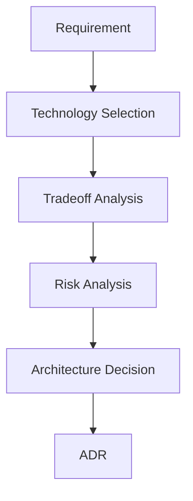

---

# 8. Documentation & Knowledge Skills

| Skill                        | Purpose                        |
| ---------------------------- | ------------------------------ |
| `architecture-documentation` | Document architecture          |
| `api-documentation`          | Create API documentation       |
| `adr-documentation`          | Create ADRs                    |
| `runbook-generation`         | Create operational runbooks    |
| `technical-design-doc`       | Create design documents        |
| `engineering-guidelines`     | Create engineering standards   |
| `migration-documentation`    | Document migration strategy    |
| `onboarding-guide`           | Create technical onboarding    |
| `architecture-diagram`       | Generate architecture diagrams |
| `sequence-diagram`           | Generate sequence diagrams     |
| `dependency-diagram`         | Generate dependency diagrams   |

---

# 9. Engineering Analysis Skills

These are particularly useful for senior engineers and architects working with existing systems.

| Skill                       | Purpose                           |
| --------------------------- | --------------------------------- |
| `codebase-analysis`         | Understand an unfamiliar codebase |
| `architecture-discovery`    | Reverse-engineer architecture     |
| `dependency-mapping`        | Map dependencies                  |
| `service-boundary-analysis` | Evaluate microservice boundaries  |
| `coupling-analysis`         | Identify coupling                 |
| `cohesion-analysis`         | Analyze component cohesion        |
| `complexity-analysis`       | Analyze system/code complexity    |
| `bottleneck-analysis`       | Find bottlenecks                  |
| `failure-mode-analysis`     | Identify failure scenarios        |
| `risk-analysis`             | Identify technical risks          |

---

# 10. The Most Important Meta-Skill: `skill-orchestrator`

Create a dedicated meta-skill:

```text
skills/meta/skill-orchestrator/
```

Its purpose is **not to solve the engineering problem directly**.

Its job is to answer:

> **Which skills should I use, in what order, and why?**

For example, for:

> "We need to migrate our monolith to microservices."

The orchestrator could determine:

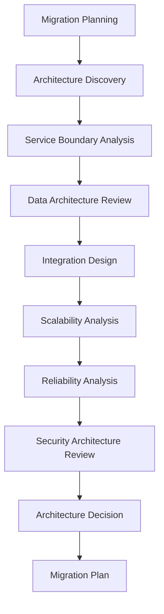

For:

> "We need to introduce an AI agent that processes customer support tickets."

It could compose:

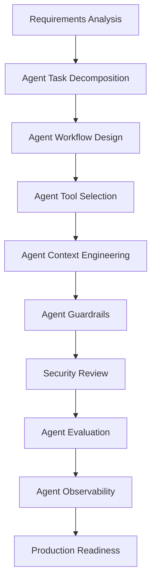

---

# 11. Skill Taxonomy

The orchestrator should understand relationships between skills.

Example:

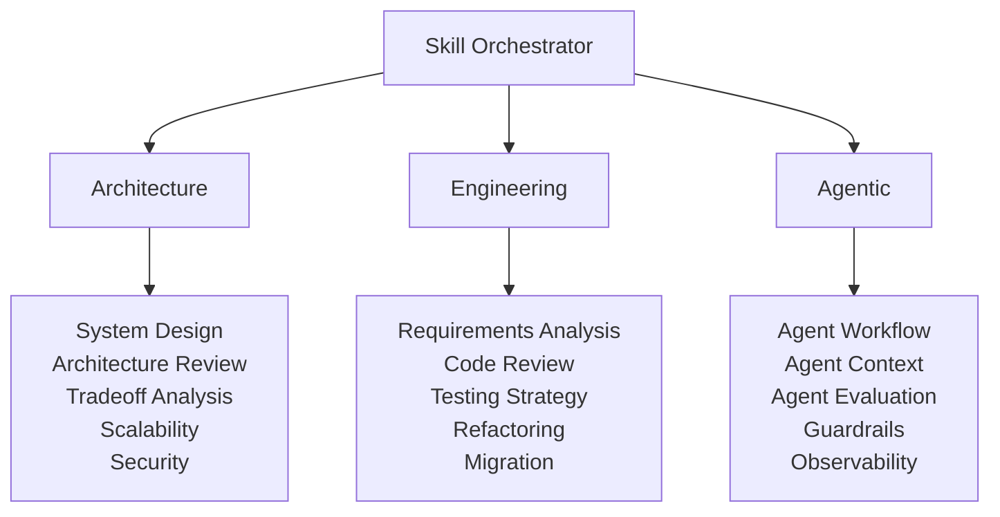

Skills should also define dependencies.

Example:

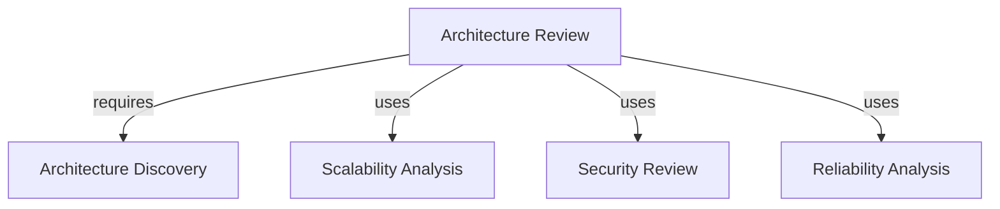

This creates a **machine-readable skill graph**.

---

# 12. Skill Authoring Meta-Skill

Create another meta-skill:

```text
skills/meta/skill-authoring/
```

Its purpose is to teach contributors how to create high-quality skills.

Recommended workflow:

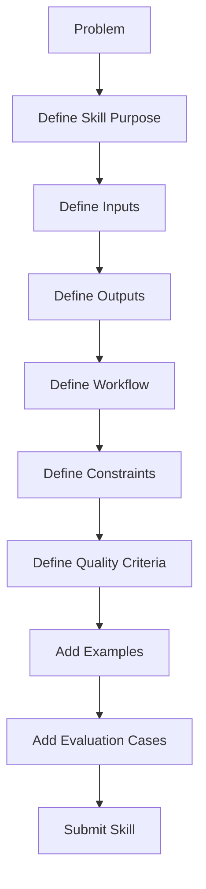

This makes the repository capable of growing through community contributions.

---

# 13. Standard Skill Contract

Every skill should follow the same structure.

Recommended `SKILL.md` structure:

```text
# Skill Name

## Purpose

## When to Use

## When NOT to Use

## Inputs

## Expected Outputs

## Workflow

## Decision Framework

## Quality Checklist

## Common Mistakes

## Examples

## Related Skills

## Skill Composition

## Evaluation Criteria
```

A skill should be understandable without reading the entire repository.

---

# 14. Machine-Readable Skill Metadata

Each skill can expose metadata such as:

```yaml
name: architecture-review

category: architecture

inputs:
  - architecture
  - requirements
  - constraints

outputs:
  - findings
  - risks
  - recommendations

requires:
  - architecture-discovery

commonly_followed_by:
  - scalability-analysis
  - security-architecture-review
  - reliability-analysis
  - architecture-decision
```

This enables automated discovery and orchestration.

A future `catalog/skills.yaml` can contain the metadata for the entire repository.

---

# 15. Skill Graph

The repository should evolve from a collection of files into a skill graph.

Instead of thinking:

```text
50 SKILL.md files
```

think:

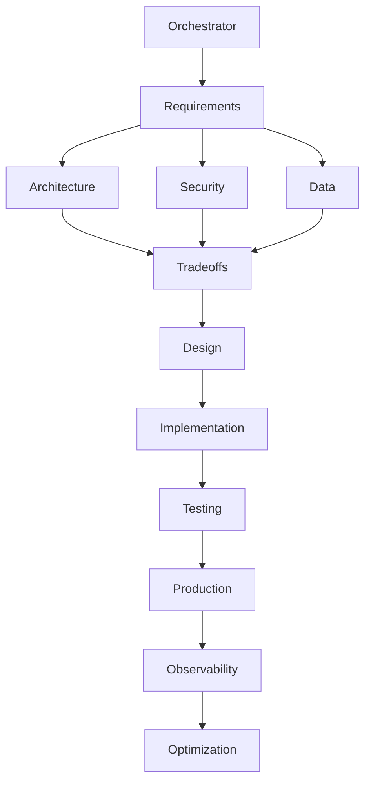

---

# 16. Workflow Recipes

In addition to individual skills, create reusable workflow recipes.

## New Feature

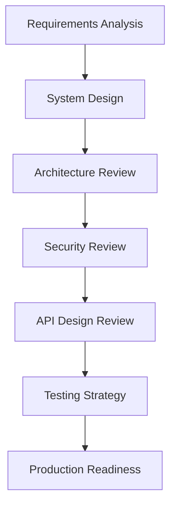

## New AI Agent

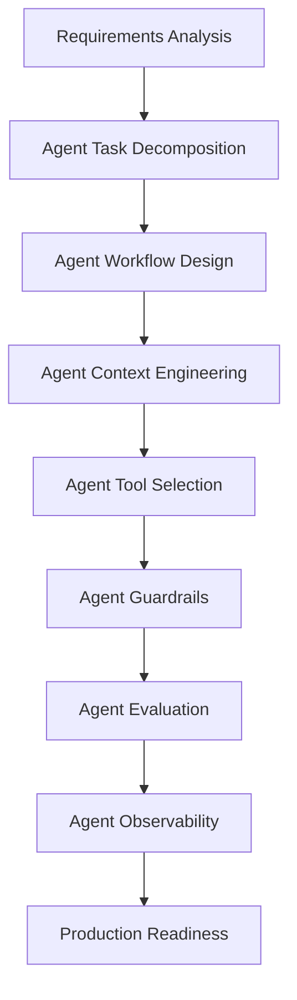

## Frontend Feature

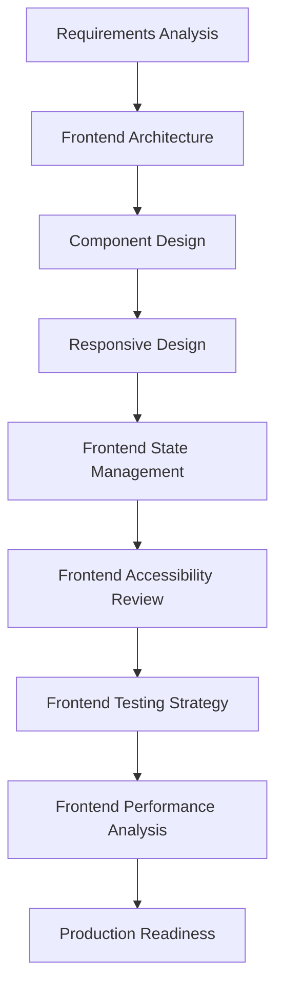

## E2E Testing

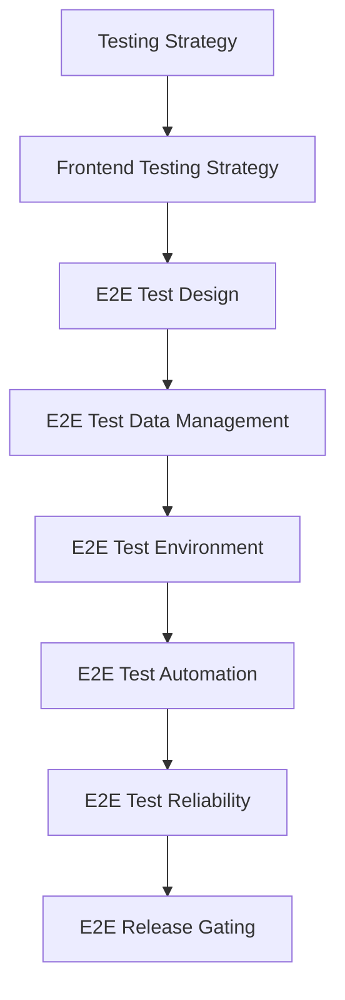

## Legacy Modernization

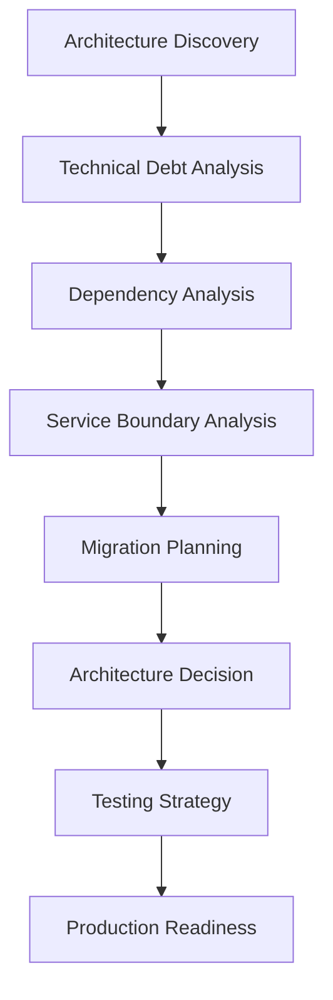

Workflow recipes give users two ways to work:

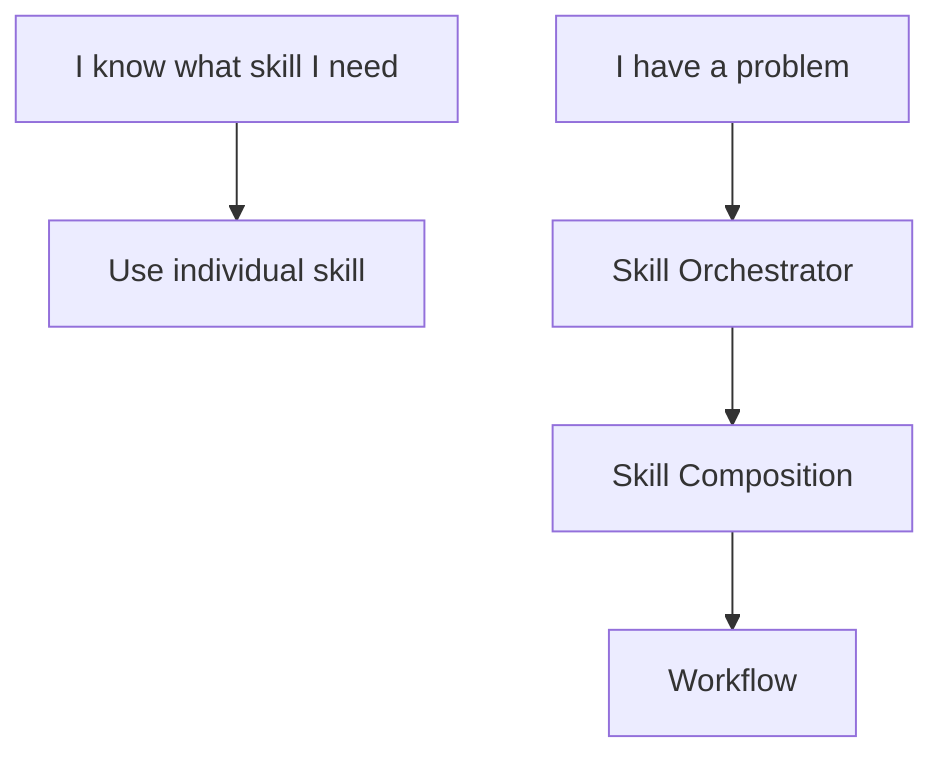

---

# 17. Recommended Repository Structure

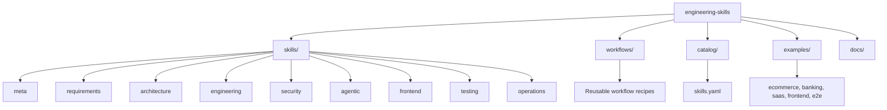

---

# 18. Recommended Initial Release

Do not start with 100 skills.

Start with approximately **20 highly polished skills**.

## Phase 1 — Foundation

```text
01 skill-orchestrator
02 skill-authoring

03 requirements-analysis
04 architecture-discovery
05 system-design
06 architecture-review
07 architecture-decision
08 tradeoff-analysis
09 scalability-analysis
10 reliability-analysis
11 security-architecture-review
12 api-design-review
13 data-architecture-review
14 code-review
15 refactoring
16 testing-strategy
17 migration-planning
18 technical-debt-analysis
19 production-readiness
20 technical-design-document
```

These 20 can already provide substantial practical value.

---

# 19. Phase 2 — Agentic Engineering

Add:

```text
21 agent-task-decomposition
22 agent-workflow-design
23 agent-context-engineering
24 agent-instruction-design
25 agent-tool-selection
26 agent-handoff-design
27 agent-guardrails
28 agent-evaluation
29 agent-observability
30 agentic-workflow-review
```

This gives the repository a distinctive focus on:

> **Practical AI-assisted and agentic software architecture.**

---

# 20. Phase 3 — Engineering Operations

Add:

```text
31 incident-analysis
32 root-cause-analysis
33 observability-design
34 capacity-planning
35 disaster-recovery
36 backup-recovery
37 cloud-architecture-review
38 ci-cd-design
39 deployment-strategy
40 cost-optimization
```

---

# 21. North-Star Architecture

The overall repository can eventually operate like this:

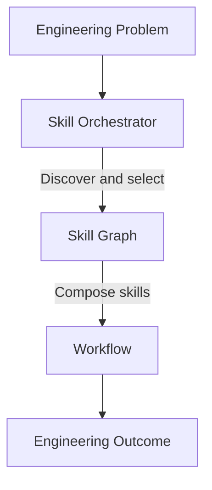

---

# 22. Project Positioning

Avoid positioning the project as:

> "A collection of AI skills for software development."

A stronger positioning is:

> **"An open-source, composable engineering skill library for architecture, software engineering, and agentic development."**

The key differentiator is that the repository is not just a set of independent prompts. It is designed as:

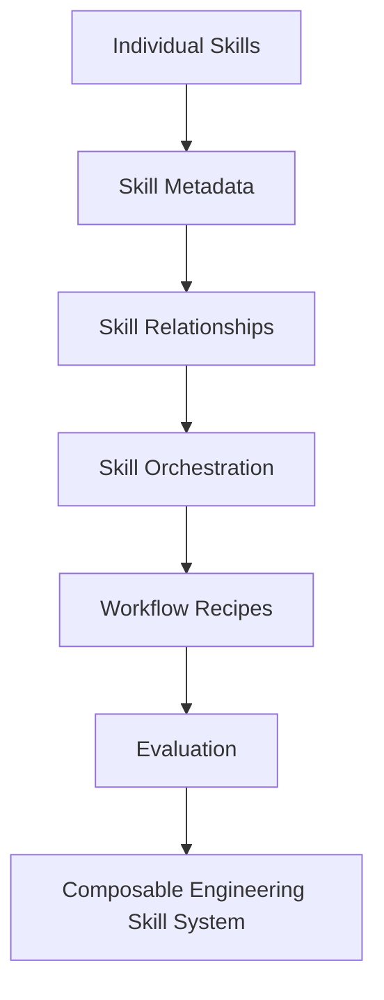

---

# 23. Long-Term Direction

The architecture should remain vendor-neutral so that the same skills can eventually be used with:

- GitHub Copilot
- Claude
- Cursor
- Codex
- Other AI coding agents
- MCP-based workflows
- Custom internal engineering agents

The repository can evolve through the following stages:

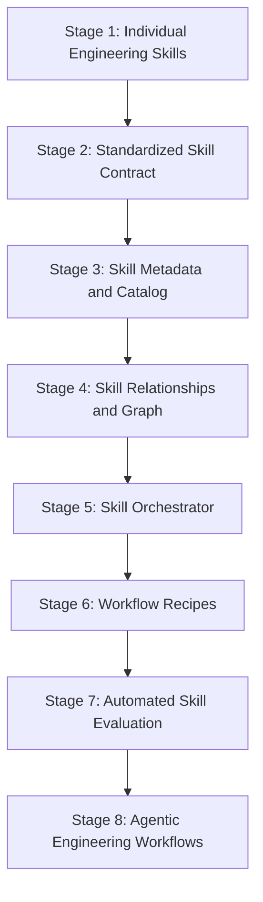

The ultimate goal is to make engineering expertise **discoverable, reusable, composable, and executable by both humans and AI agents**.
