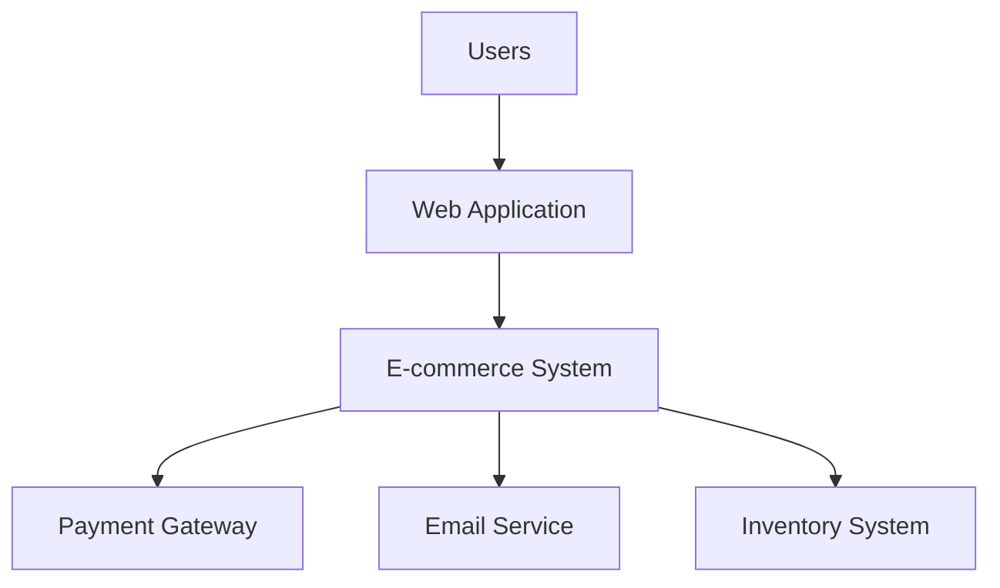
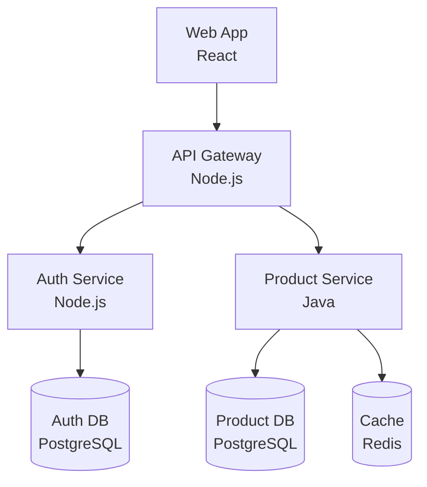

# Architecture Discovery - Detailed Instructions

## Step-by-Step Guide

### Phase 1: Initial Investigation

#### 1. Gather Existing Materials

**Documentation:**
- Architecture diagrams (even if outdated)
- Design documents
- README files
- Wiki pages
- ADRs (Architecture Decision Records)
- Runbooks

**Code:**
- Clone all repositories
- Identify main repositories vs. supporting ones
- Review repository structure
- Check for monorepo vs. multi-repo

**Infrastructure:**
- Infrastructure as Code (Terraform, CloudFormation, etc.)
- Kubernetes manifests
- Docker Compose files
- CI/CD pipeline configurations

#### 2. Interview Stakeholders

**Questions for engineers:**
- What are the main components?
- How do they communicate?
- What are the pain points?
- What are the critical paths?
- What would you change if you could?

**Questions for operations:**
- How is the system deployed?
- What are the scaling characteristics?
- What are common incidents?
- What monitoring is in place?

### Phase 2: System Analysis

#### 1. Identify Entry Points

**User-facing:**
- Web applications
- Mobile apps
- APIs

**System-facing:**
- Scheduled jobs
- Event processors
- Webhooks

**Tools:**
```bash
# Find web servers
grep -r "express\|fastify\|flask\|django" .

# Find API routes
grep -r "@app.route\|@GetMapping\|@PostMapping" .

# Find scheduled jobs
grep -r "cron\|schedule\|@scheduled" .
```

#### 2. Map Components

**Identify services:**
```bash
# List directories that look like services
ls -d */

# Check for service definitions
find . -name "docker-compose.yml" -o -name "deployment.yaml"

# Check package.json or similar for service names
find . -name "package.json" -exec grep -H "name" {} \;
```

**For each component, document:**
- Name
- Purpose/responsibility
- Technology stack
- Dependencies
- Owned data
- Exposed APIs

#### 3. Analyze Dependencies

**Code dependencies:**
```bash
# Node.js
find . -name "package.json" -exec cat {} \;

# Python
find . -name "requirements.txt" -o -name "Pipfile"

# Java
find . -name "pom.xml" -o -name "build.gradle"
```

**Service dependencies:**
- Check import statements
- Review API client code
- Check environment variables for service URLs
- Review docker-compose or k8s configs

### Phase 3: Communication Patterns

#### 1. Identify Synchronous Communication

**REST APIs:**
```bash
# Find HTTP clients
grep -r "axios\|fetch\|requests\|RestTemplate" .

# Find API endpoints
grep -r "@GetMapping\|@PostMapping\|@app.route" .
```

**Document for each API:**
- Caller → Callee
- Purpose
- Authentication method
- Data format (JSON, XML, etc.)

#### 2. Identify Asynchronous Communication

**Message queues:**
```bash
# Find message queue usage
grep -r "rabbitmq\|kafka\|sqs\|pubsub" .

# Find publishers
grep -r "publish\|send\|produce" .

# Find consumers
grep -r "subscribe\|consume\|listen" .
```

**Document for each message:**
- Publisher → Queue/Topic → Consumer
- Message type
- Purpose
- Failure handling

#### 3. Identify Database Access

```bash
# Find database connections
grep -r "DATABASE_URL\|MONGO_URI\|REDIS_URL" .

# Find ORM usage
grep -r "sequelize\|mongoose\|sqlalchemy\|hibernate" .
```

**Document:**
- Which component owns which database
- Shared databases (anti-pattern but common)
- Database types (SQL, NoSQL, cache)

### Phase 4: Data Architecture

#### 1. Identify Data Stores

**Types:**
- Relational databases (PostgreSQL, MySQL)
- NoSQL databases (MongoDB, DynamoDB)
- Caches (Redis, Memcached)
- Object storage (S3, GCS)
- Search engines (Elasticsearch)

**For each data store:**
- Type and technology
- Owner (which service)
- Purpose
- Size/scale
- Backup/recovery

#### 2. Map Data Flows

**Identify:**
- Where data originates
- How it flows through the system
- Where it's transformed
- Where it's stored
- Where it's consumed

**Create data flow diagrams:**
```
User Input → API → Service A → Database
                 ↓
              Queue → Service B → Cache
```

### Phase 5: Infrastructure Analysis

#### 1. Deployment Architecture

**Cloud provider:**
- AWS, GCP, Azure, or on-prem?
- Which services are used?

**Container orchestration:**
- Kubernetes, ECS, Docker Swarm?
- Cluster configuration

**Networking:**
- VPC/network configuration
- Load balancers
- CDN
- DNS

#### 2. Scaling and Reliability

**Scaling:**
- Horizontal vs. vertical
- Auto-scaling configuration
- Load balancing strategy

**Reliability:**
- Redundancy
- Failover mechanisms
- Backup and recovery

### Phase 6: Documentation

#### 1. Create System Context Diagram

**Include:**
- The system (as a box)
- External users
- External systems
- Key integrations

**Tools:**
- draw.io
- Lucidchart
- PlantUML
- Mermaid

**Example (Mermaid):**


#### 2. Create Container Diagram

**Include:**
- All services/applications
- Databases
- Message queues
- Caches
- Communication patterns

**Example:**


#### 3. Write Architecture Documentation

**Structure:**
```markdown
# System Architecture

## Overview
[High-level description]

## System Context
[External dependencies and users]

## Components
### Component A
- Purpose:
- Technology:
- Responsibilities:
- Dependencies:
- Data stores:

## Communication Patterns
### Synchronous
[REST APIs, gRPC, etc.]

### Asynchronous
[Message queues, events, etc.]

## Data Architecture
[Data stores, ownership, flows]

## Infrastructure
[Deployment, scaling, networking]

## Technology Stack
[Languages, frameworks, tools]

## Known Issues
[Technical debt, limitations]

## Future Considerations
[Planned changes, improvements]
```

### Phase 7: Validation

#### 1. Verify Against Running System

**Check logs:**
- Confirm communication patterns
- Verify component interactions

**Check metrics:**
- Validate traffic patterns
- Confirm scaling behavior

**Check traces:**
- Verify request flows
- Confirm dependencies

#### 2. Review with Team

**Stakeholders:**
- Original architects
- Current engineers
- Operations team

**Questions:**
- Is this accurate?
- What's missing?
- What's changed recently?
- What should be highlighted?

## Tools and Techniques

### Code Analysis Tools

**Dependency visualization:**
- `madge` (JavaScript)
- `pydeps` (Python)
- `jdeps` (Java)

**Architecture visualization:**
- Structurizr
- C4 model tools
- PlantUML

### Infrastructure Analysis

**Cloud:**
- AWS: `aws-cli`, CloudMapper
- GCP: `gcloud`, Forseti
- Azure: `az-cli`

**Kubernetes:**
- `kubectl get all`
- `kubectl describe`
- Lens (GUI)

### Runtime Analysis

**Tracing:**
- Jaeger
- Zipkin
- AWS X-Ray

**Logging:**
- ELK stack
- Splunk
- CloudWatch

**Metrics:**
- Prometheus
- Grafana
- Datadog

## Common Patterns to Look For

### Microservices
- Multiple small services
- API gateway
- Service mesh
- Event-driven communication

### Monolith
- Single large application
- Shared database
- Internal modules

### Serverless
- Functions as a Service
- Event-driven
- Managed services

### Event-Driven
- Message queues
- Event bus
- Async processing

## Next Steps

After architecture discovery:

1. **Architecture Review**: Assess the discovered architecture
2. **Technical Debt Analysis**: Identify issues and improvements
3. **Migration Planning**: Plan architectural improvements
